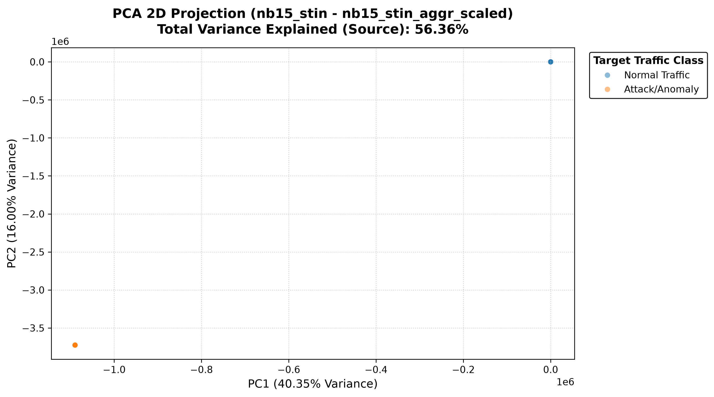
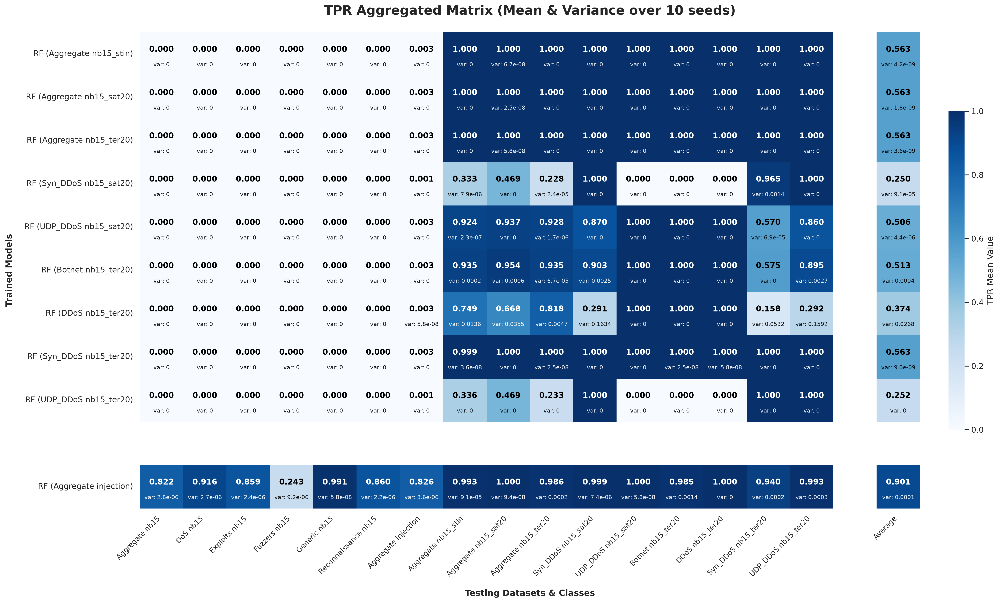

# Earth-Trained Satellite IDS

[](LICENSE) [](#raw-data-and-dataset-sources) [](#scope-and-workflow)

Feasibility study of a cross-domain, hybrid intrusion-detection pipeline for satellite-network traffic. The project aligns terrestrial and satellite traffic data in a shared feature space, builds supervised binary classifiers, evaluates their cross-dataset performance, and analyses the variability of the results across multiple random seeds.

The current implementation trains three supervised scikit-learn model families:

- Random Forest (`rf`)
- Decision Tree (`dt`)
- HistGradientBoosting (`hgb`)

Although the original project description refers to Random Forest and Isolation Forest, no Isolation Forest implementation is currently present in the source code.

<p align="center">
	
	
</p>

<p align="center"><em>Examples of the source-anchored feature analysis and cross-domain performance analysis included in the repository.</em></p>

<details>
<summary><strong>Repository snapshot at a glance</strong></summary>

| Area | Contents |
| --- | --- |
| Data processing | Raw-data alignment, feature engineering, stratified splitting and hybrid-dataset construction |
| Learning | Random Forest, Decision Tree and HistGradientBoosting |
| Evaluation | Classification metrics, probability analysis, PR curves and threshold analysis |
| Explainability | Feature importance and SHAP summaries |
| Statistical analysis | Multi-seed aggregation and Welch's t-test |
| Documentation | LaTeX thesis source, generated PDF and presentation |

</details>

## Scope and workflow

The executable pipeline in `main.py` is organized into four phases:

1. **Preprocessing**: reads the three raw CSV datasets, removes or merges selected classes, maps their schemas to a common set of features, creates stratified train/test partitions, and writes derived datasets and metadata.
2. **Model building**: trains every configured model family on every configured training dataset for each of the ten seeds.
3. **Classification**: loads the serialized models and evaluates them on every dataset listed in the classification-path inventory. It stores metrics and generates diagnostic plots.
4. **Welch's t-test**: aggregates the configured `F1-Score` across seeds and compares the reference `injection` model with the other models using Welch's t-test at `alpha = 0.05`.

The full pipeline executes these phases in order. Classification also creates per-model and aggregated performance heatmaps.

## Repository layout

```text
.
├── main.py                         # Interactive pipeline entry point
├── requirements.txt                # Direct runtime dependencies
├── requirements_fixed.txt          # Additional captured environment packages
├── src/
│   ├── data_preprocessing.py       # Dataset alignment and train/test splitting
│   ├── file_preprocessing.py       # Derived datasets and metadata files
│   ├── models.py                   # Model training and Joblib serialization
│   ├── classification.py           # Model loading, prediction and evaluation
│   ├── plotting.py                 # EDA, performance and explainability plots
│   └── utils/
│       ├── config.py               # Paths, constants, routines and plot flags
│       ├── file_utils.py            # CSV, path and aggregation utilities
│       └── metrics.py               # Metrics, feature statistics and Welch's test
├── data/
│   ├── raw/                        # nb15.csv, sat20.csv and ter20.csv
│   ├── nb15_models_preprocessed_data/
│   └── hybrid_models_preprocessed_data/
├── runs/                            # Stored model, metric and plot artifacts
└── doc/                             # LaTeX thesis, bibliography, tables and slides
```

The repository also contains Python bytecode, a local `venv/` directory, compiled LaTeX files, PDFs, and generated experiment artifacts. These are implementation or output artifacts rather than additional source modules.

## Input datasets

### Raw data and dataset sources

The raw CSV files are intentionally not included in this repository. The `.gitignore` file excludes the raw-data directories and the preprocessing pipeline expects the files locally at the paths shown below. The sources referenced by the thesis are:

- [UNSW-NB15 dataset](https://research.unsw.edu.au/projects/unsw-nb15-dataset), used by the `nb15` preprocessing path;
- [STIN dataset repository](https://github.com/kun9717/STIN-data-set/), referenced for the satellite and terrestrial traffic data used by the `sat20` and `ter20` paths.

After obtaining the data from their respective sources, place the required CSV files in the configured `data/raw/` directory:

```text
data/raw/nb15.csv
data/raw/sat20.csv
data/raw/ter20.csv
```

The repository does not contain an automated download script. Dataset licensing, access conditions, file naming, and any required conversion remain subject to the original dataset providers. The exact columns required by this implementation are listed below.

<details>
<summary><strong>Expected raw-data schemas</strong></summary>

`nb15` is processed through the NB15-specific alignment path. The `sat20` and `ter20` inputs use the STIN-style alignment path. The preprocessing code expects the following raw columns.

### NB15 input

`dur`, `sbytes`, `dbytes`, `spkts`, `dpkts`, `swin`, `dwin`, `sload`, `dload`, `sinpkt`, `dinpkt`, `attack_cat`, and `label`.

The classes `Analysis`, `Backdoor`, `Shellcode`, and `Worms` are removed before alignment.

### SAT20 and TER20 input

`fl_dur`, `l_fw_pkt`, `l_bw_pkt`, `fw_pk`, `bw_pkt_s`, `fw_win_byt`, `bw_win_byt`, `fl_byt_s`, `fl_iat_min`, `down_up_ratio`, and `label`.

For `ter20`, `Botnet`, `Web Attack`, and `Backdoor` are merged into `Botnet`; `LDAP_DDoS`, `MSSQL_DDoS`, `NetBIOS_DDoS`, and `Portmap_DDoS` are merged into `DDoS`. The satellite and terrestrial inputs are assigned binary anomaly labels by the alignment code.

</details>

## Feature engineering and dataset generation

All three input schemas are mapped to the following 16 common numeric features:

```text
duration, src_bytes, dst_bytes, src_pkts, dst_pkts,
src_win_byt, dst_win_byt, load_s, down_up_ratio, total_bytes,
total_pkts, src_mean_pkt_size, dst_mean_pkt_size, pkts_per_sec,
win_diff, byte_ratio
```

Each processed row also contains:

- `class`: the original or merged traffic class;
- `label`: binary target, where `0` is normal traffic and `1` is anomaly traffic;
- `split_type`: `train` or `test`.

The split is performed independently within each `class`, using `80%` for training and `20%` for testing. The main preprocessing seed is `127001`. Sampling and concatenation are performed without replacement, and the normal-to-anomaly ratio used by the file-preprocessing routines is `10:1`.

For each single dataset, the pipeline can create aggregated data, per-class CSV files, normal/anomaly binary subsets, scaled aggregate data where configured, and feature mean/variance records. Hybrid data are assembled from NB15 normal traffic and anomaly traffic from SAT20 and TER20. The configured hybrid categories are:

- `injection`: source NB15 traffic with a sparse target-domain anomaly injection;
- `nb15_stin`: NB15 normal traffic combined with SAT20 and TER20 anomalies;
- `nb15_sat20`: NB15 normal traffic combined with SAT20 anomalies;
- `nb15_ter20`: NB15 normal traffic combined with TER20 anomalies.

The injection construction uses `INJECTION_RATIO = 299`, so the sampled STIN anomaly component and NB15 anomaly component are combined according to the ratio implemented in `hybrid_dataset_file_preprocessing`.

## Models and reproducibility

The configured model types are `rf`, `dt`, and `hgb`. Model training:

- fits only rows with `split_type == "train"`;
- evaluates immediately on rows with `split_type == "test"`;
- uses `label` as the target;
- excludes `label`, `class`, and `split_type` from the feature matrix;
- saves the trained estimator with Joblib;
- records the model path in `models_registry.csv`;
- records model parameters and training metrics in `models_metadata.csv`.

The routine repeats training with these seeds:

```text
0, 1, 7, 42, 101, 123, 999, 1337, 2026, 12345
```

## Metrics and statistical analysis

The evaluation code records the confusion-matrix counts and the following measures:

`TP`, `TN`, `FP`, `FN`, `Accuracy`, `Precision`, `Recall`, `F1-Score`, `ROC-AUC`, `PR-AUC`, `TPR`, `FNR`, `TNR`, and `FPR`.

Metrics are rounded to four decimal places. If a test set contains only one binary class, metrics requiring both classes are stored as unavailable while the applicable confusion-derived rates are still calculated.

For each model family, the Welch analysis averages `F1-Score` over the evaluated datasets for each seed. It then compares the model whose name contains `injection` with the other models and writes the test statistic, p-value, significance level, and significance decision.

## Plots and explainability

Plot generation is controlled by `PlotFlags` in `src/utils/config.py`. The enabled flags cover:

- source-anchored two-dimensional PCA projections;
- source-anchored KDE distributions for `pkts_per_sec`, `total_bytes`, and `dst_win_byt`;
- feature-importance charts;
- predicted-probability distributions with the `0.5` threshold;
- precision-recall curves;
- precision, recall and F1-score threshold analysis;
- SHAP summary plots;
- per-run and cross-seed performance heatmaps for `TNR` and `TPR`.

SHAP is enabled by default and can be computationally expensive. The remaining switches can be changed before execution when only a subset of plots is required. HGB models do not expose the same native impurity-based feature-importance attribute as Random Forest and Decision Tree models; the training routine therefore skips that plot for HGB in its current call path.

## Installation

No Python version is declared by the repository. Use a Python environment compatible with the pinned packages and install the direct dependencies with:

```bash
python -m pip install -r requirements.txt
```

`requirements.txt` lists the direct packages used by the application: Joblib, Matplotlib, NumPy, pandas, scikit-learn, SciPy, Seaborn, and SHAP. `requirements_fixed.txt` is a larger captured environment list and includes transitive and tooling packages such as `pytest`, `numba`, and `llvmlite`.

## Running the application

From the repository root, start the interactive dashboard:

```bash
python main.py
```

The menu offers:

```text
1. Run PREPROCESSING
2. Run MODEL BUILDING
3. Run CLASSIFICATIONS
4. Run WELCH T-TEST
5. Run ALL!
6. Exit application
```

For a fresh run, execute preprocessing before model building and classification. Preprocessing creates the metadata inventories used by the later phases:

```text
data/preprocessed/metadata/datasets_info.csv
data/preprocessed/metadata/data_model_building_paths.csv
data/preprocessed/metadata/data_classification_paths.csv
data/preprocessed/metadata/feature_mean.csv
data/preprocessed/metadata/feature_variance.csv
```

The application creates missing runtime directories automatically, but model building and classification still require the referenced input CSV files and path inventories to exist.

## Runtime output layout

The paths defined in `src/utils/config.py` are designed to produce the following structure:

```text
data/preprocessed/
├── nb15/, sat20/, ter20/
├── hybrid/
│   ├── injection_aggr.csv
│   ├── nb15_stin_aggr.csv
│   ├── nb15_sat20/
│   └── nb15_ter20/
└── metadata/

runs/
├── rf/<seed>/
├── dt/<seed>/
└── hgb/<seed>/
	├── models/
	│   ├── *.joblib
	│   ├── models_registry.csv
	│   ├── models_metadata.csv
	│   └── feature_importance/
	└── results/
		├── classifications.csv
		├── by_model/
		├── by_dataset/
		└── plots/
```

The repository currently also contains preprocessed snapshots under `data/nb15_models_preprocessed_data/` and `data/hybrid_models_preprocessed_data/`, and experiment snapshots under `runs/nb15_models/` and `runs/hybrid_models/`. These stored snapshot names do not exactly match the runtime paths defined by the current configuration; a new execution follows `ProjectPaths` and generates or expects `data/preprocessed/` and model-family directories directly below `runs/`.

## Source modules

- `src/data_preprocessing.py`: removes or merges classes, aligns NB15/STIN schemas, and performs class-stratified splitting.
- `src/file_preprocessing.py`: writes aggregate, class-specific, normal/anomaly, hybrid, scaled, and statistical-summary files.
- `src/models.py`: creates Random Forest, Decision Tree, or HistGradientBoosting classifiers, evaluates them, and serializes them.
- `src/classification.py`: loads Joblib models, predicts probabilities on test rows, writes classification summaries, and invokes configured plots.
- `src/plotting.py`: implements PCA, KDE, probability, PR, threshold, SHAP, feature-importance, and heatmap functions.
- `src/utils/file_utils.py`: provides CSV upsert, path validation, directory initialization, dataset inventories, result grouping, and seed aggregation.
- `src/utils/metrics.py`: calculates classification metrics, feature statistics, and Welch's t-test results.
- `src/utils/config.py`: centralizes paths, dataset targets, model types, seeds, ratios, plot ordering, and plot switches.

## Documentation

The `doc/` directory contains the LaTeX thesis source, bibliography, tables, TikZ and listings styles, generated thesis files, and a presentation under `doc/presentazione/`. The chapter sources are organized into `doc/chapters/new/` and historical material under `doc/chapters/old/`.

## Limitations and repository notes

- The application is interactive and does not define command-line arguments.
- The code assumes binary labels and classifiers exposing `predict_proba`.
- SHAP and the complete multi-seed workflow can require substantial computation and storage.
- No test suite or documented test command is included in the repository.
- The repository does not document a Python version or an automated data-download step; the raw CSV files are expected at the configured paths.

## License

This project is distributed under the MIT License. See [LICENSE](LICENSE).

## Continue the project 🚀

This repository is intended as a research starting point rather than a finished product. Continue the work by bringing new datasets into the shared feature space, validating the assumptions behind the hybrid benchmarks, comparing additional classifiers, extending the statistical analysis, and documenting reproducible experiments. Every careful improvement can make cross-domain intrusion detection for satellite networks more robust, interpretable and useful.

**The next experiment is yours: reproduce the pipeline, question its assumptions, and help move the project forward.** 🌍🛰️
